# Apollo Search and Enrich System

## Overview

The Apollo Search and Enrich system is an automated lead discovery and enrichment pipeline that activates when a campaign status changes to "active". It leverages Apollo.io's powerful B2B database to find and enrich leads based on pre-configured search criteria.

## Architecture

### 1. Database Schema

#### Campaigns Table Extensions
- **`search_url`** (JSONB): Stores platform search configurations
  ```json
  {
    "apollo": {
      "search_url": "https://app.apollo.io/#/people/search?personTitles[]=CEO",
      "page_number": 1
    }
  }
  ```
- **`require_phone_number`** (BOOLEAN): Controls whether to reveal phone numbers during enrichment
- **`total_leads_discovered`** (INTEGER): Counter tracking all leads found for the campaign

#### Database Triggers

**Campaign Activation Trigger**
When a campaign's status changes to "active", a PostgreSQL trigger automatically:
1. Detects the status change
2. Extracts all platform URLs from `search_url`
3. Creates a job in the `jobs` table with type `campaign_active`

**Low Enriched Leads Trigger**
When an active campaign's enriched lead count falls below 5, a PostgreSQL trigger automatically:
1. Monitors INSERT/UPDATE/DELETE operations on the leads table
2. Counts leads with status = "enriched" for the affected campaign
3. Creates a job identical to campaign activation if count < 5
4. Includes 5-minute cooldown to prevent duplicate jobs

### 2. Job System Flow

```mermaid
graph TD
    A[Campaign Status → Active] --> B[Database Trigger Fires]
    B --> C[Job Created in jobs table<br/>status: 'pending']
    C --> D[RenderWorker Picks Up Job<br/>status: 'processing']
    D --> E[AutopilotAgent Executes]
    E --> F[Apollo Search Tool]
    F --> G[Apollo Enrich Tool]
    G --> H[Save Leads to Database]
    H --> I[Update Page Number]
    I --> J[Update Lead Counter]
    J --> K{Success?}
    K -->|Yes| L[Update Job<br/>status: 'completed'<br/>result: execution data]
    K -->|No| M[Update Job<br/>status: 'failed'<br/>result: error details]
```



### Job Lifecycle

The job transitions through several statuses:

1. **pending** - Job created by trigger, waiting for worker
2. **processing** - Worker picked up job and is executing
3. **completed** - Job finished successfully with results
4. **failed** - Job failed with error details

#### Success Result Structure
```json
{
  "success": true,
  "job_id": "123e4567-e89b-12d3-a456-426614174000",
  "job_type": "campaign_active",
  "result": {
    "leads_found": 25,
    "leads_created": 20,
    "duplicate_leads": 5,
    "next_page": 2,
    "platform": "apollo"
  },
  "completed_at": "2025-01-30T12:00:00Z"
}
```

**Note**: Jobs created by the low enriched leads trigger will include `"triggered_by": "low_enriched_leads"` in the job data for tracking purposes.

#### Failure Result Structure
```json
{
  "success": false,
  "job_id": "123e4567-e89b-12d3-a456-426614174000",
  "job_type": "campaign_active",
  "error": "Apollo API rate limit reached",
  "failed_at": "2025-01-30T12:00:00Z"
}
```

### 3. Apollo Tools

#### Apollo Search Tool (`apollo_search_tool.py`)
- Takes pre-configured Apollo search URLs
- Appends page number for pagination
- Returns structured lead data
- Handles API errors and rate limiting

#### Apollo Enrich Tool (`apollo_enrich_tool.py`)
- Enriches leads with additional contact information
- Always reveals personal emails
- Conditionally reveals phone numbers based on campaign setting
- Returns comprehensive profile data

## Usage

### 1. Campaign Configuration

Set up a campaign with Apollo search URL:
```python
campaign_data = {
    "name": "Tech Startups Campaign",
    "status": "draft",
    "require_phone_number": False,  # Set to True if phone numbers needed
    "search_url": {
        "apollo": {
            "search_url": "https://app.apollo.io/#/people/search?personTitles[]=CEO&organizationNumEmployeesRanges[]=11-50",
            "page_number": 1
        }
    }
}
```

### 2. Activation

Simply update the campaign status:
```python
await supabase.table("campaigns").update({
    "status": "active"
}).eq("id", campaign_id).execute()
```

This triggers the entire automation pipeline.

### 3. Lead Data Structure

Each discovered lead includes:
```python
{
    "email": "john@company.com",
    "first_name": "John",
    "last_name": "Doe",
    "title": "CEO",
    "company": "Tech Startup Inc",
    "phone": "+1234567890",  # Only if require_phone_number=True
    "status": "enriched",  # "enriched" if successful, "enrichment_failed" if not
    "full_context": {
        "source": "apollo_search",
        "source_details": {
            "platform": "apollo",
            "search_page": 1,
            "discovered_at": "2025-01-30T12:00:00Z",
            "search_url": "https://app.apollo.io/..."
        },
        "enriched": True,
        "personal_emails": ["john.doe@gmail.com"],
        "linkedin_url": "https://linkedin.com/in/johndoe",
        "apollo_id": "abc123",
        "enrichment_data": { ... }
    }
}
```

## Features

### Lead Status Management
- **`enriched`** - Lead successfully enriched with additional contact information
- **`enrichment_failed`** - Lead discovered but enrichment failed or wasn't attempted
- Status is automatically set based on enrichment success

### Automatic Pagination
- Tracks page numbers per platform
- Automatically increments after each successful search
- Allows resuming from where it left off

### Duplicate Detection
- Checks for existing leads by email within the same campaign
- Prevents duplicate entries
- Tracks duplicate count for reporting

### Source Tracking
- Every lead includes source information
- Tracks which platform, page, and search URL discovered the lead
- Timestamps for audit trail

### Credit Optimization
- Phone number enrichment only when required
- Reduces unnecessary credit consumption
- Personal emails always included (lower credit cost)

### Automatic Lead Replenishment
- Monitors active campaigns for low enriched lead counts
- Automatically triggers new lead discovery when count < 5
- Prevents campaign starvation during outreach
- 5-minute cooldown prevents job spam
- Uses same discovery logic as initial activation

### Error Handling
- Specific error messages for different failure types:
  - "Apollo API rate limit reached"
  - "Apollo API credits exhausted"
  - "No more leads found at page X"
  - "Apollo API authentication failed"

### Metrics Tracking
- Campaign-level counter for total leads discovered
- Atomic updates prevent race conditions
- Per-job statistics (leads found, created, duplicates)

## Configuration

### Environment Variables
```bash
APOLLO_API_KEY=your_apollo_api_key_here
```

### API Endpoints Used
- **Search**: `POST https://api.apollo.io/api/v1/mixed_people/search`
- **Enrich**: `POST https://api.apollo.io/api/v1/people/match`

## Testing

Run the comprehensive test:
```bash
python -m src.testing.test_campaign_activation_flow
```

The test covers:
- Campaign creation with search URL
- Trigger activation
- Job creation and execution
- Lead discovery and enrichment
- Source tracking verification
- Metrics updates

## Best Practices

1. **Search URL Configuration**
   - Use Apollo's web interface to build search criteria
   - Copy the URL directly from the browser
   - Test with small result sets first

2. **Phone Number Usage**
   - Only enable `require_phone_number` when necessary
   - Phone enrichment costs more credits
   - Consider your use case before enabling

3. **Pagination Strategy**
   - Start with page 1 for new campaigns
   - Monitor page numbers to avoid endless searching
   - Set reasonable limits based on your needs

4. **Error Recovery**
   - Failed jobs can be retried by the RenderWorker
   - Check job results for specific error messages
   - Monitor credit usage to avoid exhaustion

## Monitoring

### Job Status
Check job execution status:
```sql
-- View recent campaign_active jobs with status
SELECT 
  id,
  status,
  data->>'campaign_name' as campaign_name,
  created_at,
  started_at,
  completed_at,
  failed_at,
  result->>'leads_created' as leads_created,
  result->>'error' as error_message
FROM jobs 
WHERE job_type = 'campaign_active' 
ORDER BY created_at DESC
LIMIT 10;

-- Check failed jobs for debugging
SELECT 
  id,
  data->>'campaign_id' as campaign_id,
  result->>'error' as error,
  failed_at,
  retry_count
FROM jobs 
WHERE job_type = 'campaign_active' 
  AND status = 'failed'
ORDER BY failed_at DESC;
```

### Campaign Metrics
View campaign lead discovery metrics:
```sql
SELECT name, total_leads_discovered, search_url
FROM campaigns
WHERE status = 'active';
```

### Lead Quality
Analyze enrichment success:
```sql
SELECT 
  COUNT(*) as total_leads,
  COUNT(CASE WHEN full_context->>'enriched' = 'true' THEN 1 END) as enriched_leads,
  COUNT(phone) as with_phone
FROM leads
WHERE campaign_id = 'your_campaign_id';
```

## Future Enhancements

1. **Multi-Platform Support**
   - LinkedIn Sales Navigator integration
   - Google Maps business search
   - Other B2B databases

2. **Advanced Filtering**
   - Post-search filtering rules
   - Lead scoring integration
   - Quality thresholds

3. **Scheduling**
   - Scheduled campaign activation
   - Time-based search execution
   - Rate limit management

4. **Analytics**
   - Lead quality metrics
   - Conversion tracking
   - ROI calculation